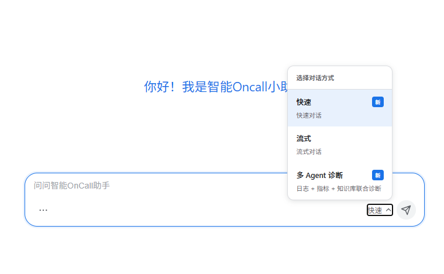
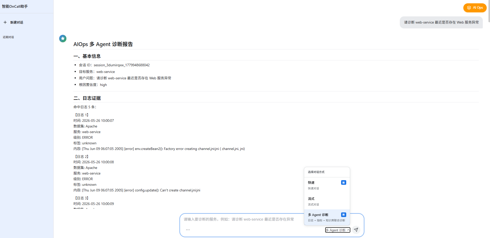
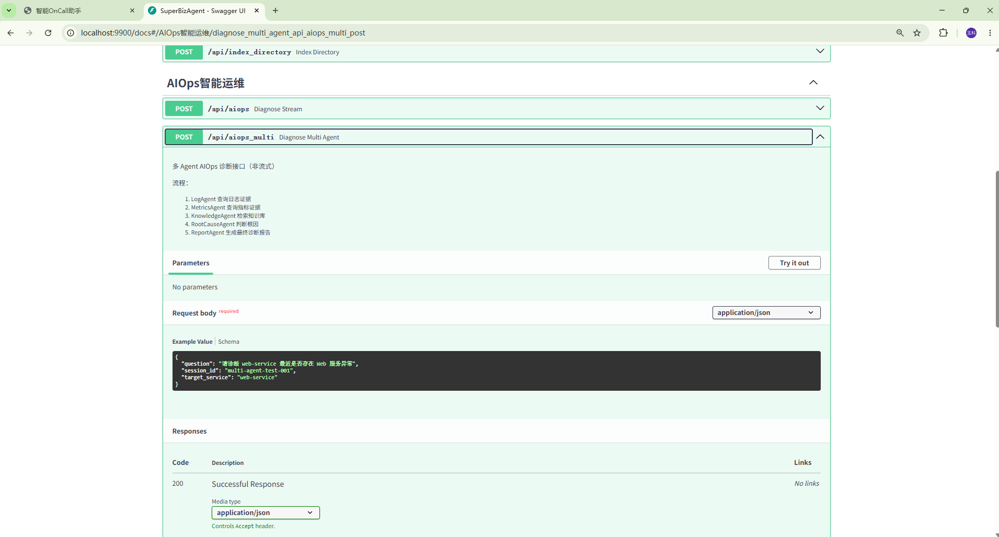
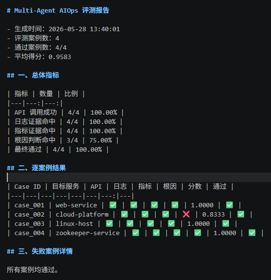

# SuperBizAgent

> 基于 FastAPI、LangChain、Milvus 和多 Agent 架构构建的 AIOps 智能诊断系统，支持 RAG 知识库问答、日志/指标证据检索、根因分析和结构化诊断报告生成。

[](https://www.python.org/)
[](https://fastapi.tiangolo.com/)
[](https://www.langchain.com/)
[](https://milvus.io/)

---

## 1. 项目简介

SuperBizAgent 是一个面向企业智能运维场景的 AIOps 智能诊断系统。

项目在传统 RAG 智能问答基础上，引入日志数据、指标数据和多 Agent 协同诊断机制，支持从用户自然语言问题出发，自动完成：

* 运维知识库检索；
* 日志异常证据查询；
* 指标 anomaly 证据查询；
* 根因分析；
* 结构化诊断报告生成；
* 自动化评测。

系统提供 Web 前端、FastAPI 后端接口、Milvus 向量库、MCP 工具接入、本地模拟观测数据层以及多 Agent 诊断模块。

---

## 2. 核心特性

* **RAG 智能问答**：基于 Milvus 向量库和 DashScope Embedding，实现运维知识文档检索增强问答。
* **AIOps 自动诊断**：支持 Plan-Execute-Replan 故障诊断流程，自动规划、执行和调整诊断步骤。
* **多 Agent 协同诊断**：新增 Supervisor + LogAgent + MetricsAgent + KnowledgeAgent + RootCauseAgent + ReportAgent 架构。
* **日志与指标联合分析**：接入 Loghub 日志数据和 NetManAIOps KPI 指标数据，支持日志证据和异常指标联合诊断。
* **本地观测工具**：封装 `query_mock_logs` 和 `query_mock_metrics`，模拟日志平台和监控平台查询能力。
* **自动化评测**：构建 AIOps 诊断评测集，支持 API 成功率、日志命中率、指标命中率、根因判断命中率评估。
* **Web 前端入口**：前端支持快速问答、流式问答和多 Agent 诊断模式。
* **MCP 工具集成**：保留日志查询、监控查询等 MCP 工具扩展能力。

---

## 3. 系统架构

```text
用户问题
   │
   ▼
Web 前端 / API
   │
   ├── 普通 RAG 问答：/api/chat
   ├── 流式问答：/api/chat_stream
   ├── Plan-Execute-Replan AIOps：/api/aiops
   └── 多 Agent AIOps：/api/aiops_multi
          │
          ▼
   Supervisor
      ├── LogAgent：查询日志证据
      ├── MetricsAgent：查询指标异常
      ├── KnowledgeAgent：检索知识库
      ├── RootCauseAgent：判断根因
      └── ReportAgent：生成诊断报告
          │
          ▼
   结构化 AIOps 诊断报告
```

---

## 4. 技术栈

| 类型        | 技术                         |
| --------- | -------------------------- |
| 后端框架      | FastAPI                    |
| Agent 框架  | LangChain / LangGraph      |
| 大模型       | 阿里云 DashScope / 通义千问       |
| Embedding | DashScope Embedding        |
| 向量数据库     | Milvus                     |
| 工具协议      | MCP                        |
| 数据处理      | Python / Pandas            |
| 前端        | 原生 HTML / CSS / JavaScript |
| 容器化       | Docker / Docker Compose    |

---

## 5. 功能模块

### 5.1 RAG 知识库问答

系统支持上传 Markdown 运维文档，并自动完成：

1. 文档读取；
2. 文档切分；
3. Embedding 向量化；
4. Milvus 入库；
5. 用户问题检索；
6. 基于检索内容生成回答。

知识库文档存放于：

```text
aiops-docs/
```

---

### 5.2 Plan-Execute-Replan AIOps 诊断

原有 AIOps 模块采用 Plan-Execute-Replan 模式：

```text
Planner 制定诊断计划
   ↓
Executor 执行诊断步骤并调用工具
   ↓
Replanner 根据结果决定继续、调整或结束
   ↓
生成诊断报告
```

该模块对应接口：

```text
POST /api/aiops
```

---

### 5.3 多 Agent AIOps 诊断模块

本项目新增多 Agent 协同诊断流程，将故障诊断拆分为多个专家 Agent。

| Agent          | 作用                                          |
| -------------- | ------------------------------------------- |
| Supervisor     | 统一调度完整诊断流程                                  |
| LogAgent       | 查询目标服务日志，提取 ERROR/WARN/failed/timeout 等异常证据 |
| MetricsAgent   | 查询目标服务对应的 anomaly 指标数据                      |
| KnowledgeAgent | 检索 AIOps 知识库中的排障经验                          |
| RootCauseAgent | 综合日志、指标和知识库证据判断可能根因                         |
| ReportAgent    | 生成结构化 Markdown 诊断报告                         |

诊断流程：

```text
用户问题
→ Supervisor 推断目标服务
→ LogAgent 查询日志证据
→ MetricsAgent 查询异常指标
→ KnowledgeAgent 检索知识库
→ RootCauseAgent 判断根因
→ ReportAgent 输出诊断报告
```

对应接口：

```text
POST /api/aiops_multi
```

示例问题：

```text
请诊断 web-service 最近是否存在 Web 服务异常

请诊断 cloud-platform 是否存在云平台实例异常

请诊断 linux-host 是否存在系统层异常

请诊断 zookeeper-service 是否存在中间件异常
```

---

## 6. 数据集与评测

本项目引入公开 AIOps 数据集，构建日志、指标、知识库和评测案例四类数据。

### 6.1 数据组成

| 数据类型  | 来源                       |             规模 | 用途                       |
| ----- | ------------------------ | -------------: | ------------------------ |
| 日志数据  | Loghub                   |        约 36 万条 | 模拟日志平台，供 LogAgent 查询     |
| 指标数据  | NetManAIOps KPI          |        约 15 万条 | 模拟监控平台，供 MetricsAgent 查询 |
| 异常指标  | NetManAIOps KPI          | 6053 条 anomaly | 用于异常指标诊断                 |
| 运维知识库 | `aiops-docs/`            |    Markdown 文档 | 用于 RAG 检索                |
| 评测案例  | `eval/aiops_cases.jsonl` |        4 个基础案例 | 用于验证诊断链路                 |

### 6.2 数据目录

```text
data/
├── raw/
│   ├── loghub/          # 原始 Loghub 日志数据
│   └── kpi/             # 原始 NetManAIOps KPI 数据
├── mock_logs/           # 清洗后的日志数据
│   ├── all_logs.jsonl
│   ├── application_logs.jsonl
│   ├── system_logs.jsonl
│   └── middleware_logs.jsonl
└── mock_metrics/        # 清洗后的指标数据
    └── metrics.csv

eval/
├── aiops_cases.jsonl    # 诊断评测案例
└── results/             # 自动化评测结果
```

### 6.3 数据清洗脚本

```text
scripts/
├── prepare_loghub_logs.py      # 清洗 Loghub 日志数据
├── prepare_kpi_metrics.py      # 清洗 NetManAIOps KPI 指标数据
├── search_mock_logs.py         # 本地日志查询验证脚本
├── search_mock_metrics.py      # 本地指标查询验证脚本
├── check_eval_cases.py         # 检查评测案例是否能命中证据
└── eval_multi_aiops.py         # 多 Agent 自动化评测脚本
```

### 6.4 自动化评测

运行评测脚本：

```bash
python scripts/eval_multi_aiops.py
```

评测脚本会读取：

```text
eval/aiops_cases.jsonl
```

逐条调用：

```text
POST /api/aiops_multi
```

并评估以下指标：

* API 调用成功率；
* 日志证据命中率；
* 指标异常命中率；
* 根因判断命中率；
* 报告结构完整性；
* 最终诊断通过率。

评测结果保存在：

```text
eval/results/
```

示例结果文件：

```text
eval/results/multi_aiops_eval_YYYYMMDD_HHMMSS.md
eval/results/multi_aiops_eval_YYYYMMDD_HHMMSS.jsonl
```

# Multi-Agent AIOps 评测报告

- 生成时间：2026-05-28 13:40:01
- 评测案例数：4
- 通过案例数：4/4
- 平均得分：0.9583

## 一、总体指标

| 指标 | 数量 | 比例 |
|---|---:|---:|
| API 调用成功 | 4/4 | 100.00% |
| 日志证据命中 | 4/4 | 100.00% |
| 指标证据命中 | 4/4 | 100.00% |
| 根因判断命中 | 3/4 | 75.00% |
| 最终通过 | 4/4 | 100.00% |

## 二、逐案例结果

| Case ID | 目标服务 | API | 日志 | 指标 | 根因 | 分数 | 通过 |
|---|---|---|---|---|---|---:|---|
| case_001 | web-service | ✅ | ✅ | ✅ | ✅ | 1.0000 | ✅ |
| case_002 | cloud-platform | ✅ | ✅ | ✅ | ❌ | 0.8333 | ✅ |
| case_003 | linux-host | ✅ | ✅ | ✅ | ✅ | 1.0000 | ✅ |
| case_004 | zookeeper-service | ✅ | ✅ | ✅ | ✅ | 1.0000 | ✅ |

## 三、失败案例详情

所有案例均通过。
---

## 7. 快速开始

### 7.1 环境要求

* Python 3.11+
* Docker Desktop
* 阿里云 DashScope API Key
* Windows / Linux / macOS 均可运行

---

### 7.2 克隆项目

```bash
git clone <repository_url>
cd super_biz_agent_py
```

---

### 7.3 创建虚拟环境并安装依赖

#### 方式一：使用 uv

```bash
pip install uv
uv venv
```

Windows 激活：

```powershell
.venv\Scripts\activate
```

Linux/macOS 激活：

```bash
source .venv/bin/activate
```

安装依赖：

```bash
uv pip install -e .
```

#### 方式二：使用 pip

```bash
python -m venv .venv
```

Windows 激活：

```powershell
.venv\Scripts\activate
```

Linux/macOS 激活：

```bash
source .venv/bin/activate
```

安装依赖：

```bash
pip install -e .
```

---

### 7.4 配置环境变量

编辑 `.env` 文件：

```bash
DASHSCOPE_API_KEY=your-api-key
DASHSCOPE_API_BASE=https://dashscope.aliyuncs.com/compatible-mode/v1
DASHSCOPE_MODEL=qwen-max

MILVUS_HOST=localhost
MILVUS_PORT=19530

RAG_TOP_K=3
CHUNK_MAX_SIZE=800
CHUNK_OVERLAP=100
```

---

### 7.5 启动 Milvus

```bash
docker compose -f vector-database.yml up -d
```

检查容器：

```bash
docker ps
```

---

### 7.6 启动后端服务

```bash
python -m uvicorn app.main:app --host 0.0.0.0 --port 9900
```

访问：

```text
http://localhost:9900
```

API 文档：

```text
http://localhost:9900/docs
```

---

### 7.7 上传知识库文档

服务启动后执行：

```bash
python -c "import requests, os, time; [requests.post('http://localhost:9900/api/upload', files={'file': open(f'aiops-docs/{f}', 'rb')}) or time.sleep(1) for f in os.listdir('aiops-docs') if f.endswith('.md')]"
```

---

### 7.8 Windows 一键脚本

项目提供 Windows 启停脚本：

```powershell
# 启动所有服务
.\start-windows.bat

# 停止所有服务
.\stop-windows.bat
```

---

## 8. API 接口

| 功能                        | 方法   | 路径                 | 说明                |
| ------------------------- | ---- | ------------------ | ----------------- |
| 普通对话                      | POST | `/api/chat`        | 一次性返回             |
| 流式对话                      | POST | `/api/chat_stream` | SSE 流式输出          |
| Plan-Execute-Replan AIOps | POST | `/api/aiops`       | 自动故障诊断            |
| 多 Agent AIOps 诊断          | POST | `/api/aiops_multi` | 日志 + 指标 + 知识库联合诊断 |
| 文件上传                      | POST | `/api/upload`      | 上传并索引文档           |
| 健康检查                      | GET  | `/api/health`      | 服务状态检查            |

---

### 8.1 普通对话

```bash
curl -X POST "http://localhost:9900/api/chat" \
  -H "Content-Type: application/json" \
  -d '{"Id":"session-123","Question":"你好"}'
```

---

### 8.2 流式对话

```bash
curl -X POST "http://localhost:9900/api/chat_stream" \
  -H "Content-Type: application/json" \
  -d '{"Id":"session-123","Question":"你好"}' \
  --no-buffer
```

---

### 8.3 Plan-Execute-Replan AIOps 诊断

```bash
curl -X POST "http://localhost:9900/api/aiops" \
  -H "Content-Type: application/json" \
  -d '{"session_id":"session-123"}' \
  --no-buffer
```

---

### 8.4 多 Agent AIOps 诊断

Windows CMD 示例：

```bat
curl.exe -X POST "http://localhost:9900/api/aiops_multi" -H "Content-Type: application/json" -d "{\"session_id\":\"multi-test-001\",\"question\":\"请诊断 web-service 最近是否存在 Web 服务异常\",\"target_service\":\"web-service\"}"
```

Linux/macOS 示例：

```bash
curl -X POST "http://localhost:9900/api/aiops_multi" \
  -H "Content-Type: application/json" \
  -d '{
    "session_id": "multi-test-001",
    "question": "请诊断 web-service 最近是否存在 Web 服务异常",
    "target_service": "web-service"
  }'
```

返回结果中包含：

```json
{
  "code": 200,
  "message": "success",
  "data": {
    "final_report": "# AIOps 多 Agent 诊断报告..."
  }
}
```

---

## 9. 前端使用方式

启动服务后访问：

```text
http://localhost:9900
```

前端支持三种对话模式：

| 模式         | 说明                                        |
| ---------- | ----------------------------------------- |
| 快速         | 普通 RAG 问答                                 |
| 流式         | SSE 流式问答                                  |
| 多 Agent 诊断 | 调用 `/api/aiops_multi`，执行日志 + 指标 + 知识库联合诊断 |

使用方式：

1. 打开 Web 页面；
2. 点击输入框右侧的模式选择；
3. 选择「多 Agent 诊断」；
4. 输入诊断问题，例如：`请诊断 web-service 最近是否存在 Web 服务异常`；
5. 系统返回结构化 AIOps 多 Agent 诊断报告。

---

## 10. 效果展示

### 10.1 前端多 Agent 诊断入口



### 10.2 多 Agent 诊断报告



### 10.3 FastAPI 接口文档



### 10.4 自动化评测结果



## 11. 项目结构

```text
super_biz_agent_py/
├── app/
│   ├── main.py                         # FastAPI 应用入口
│   ├── config.py                       # 配置管理
│   ├── api/                            # API 路由层
│   │   ├── chat.py                     # 普通/流式对话接口
│   │   ├── aiops.py                    # AIOps 与多 Agent 接口
│   │   ├── file.py                     # 文件上传接口
│   │   └── health.py                   # 健康检查接口
│   ├── services/                       # 业务服务层
│   │   ├── rag_agent_service.py        # RAG Agent
│   │   ├── aiops_service.py            # Plan-Execute-Replan AIOps
│   │   ├── vector_store_manager.py     # 向量库管理
│   │   ├── vector_embedding_service.py # Embedding 服务
│   │   ├── vector_search_service.py    # 向量检索服务
│   │   └── document_splitter_service.py# 文档切分服务
│   ├── agent/
│   │   ├── aiops/                      # 原 AIOps 计划-执行-重规划模块
│   │   │   ├── planner.py
│   │   │   ├── executor.py
│   │   │   ├── replanner.py
│   │   │   └── state.py
│   │   └── multi_aiops/                # 多 Agent AIOps 模块
│   │       ├── state.py                # 多 Agent 共享状态
│   │       ├── supervisor.py           # 总调度器
│   │       ├── log_agent.py            # 日志分析 Agent
│   │       ├── metrics_agent.py        # 指标分析 Agent
│   │       ├── knowledge_agent.py      # 知识库检索 Agent
│   │       ├── root_cause_agent.py     # 根因分析 Agent
│   │       └── report_agent.py         # 报告生成 Agent
│   ├── models/                         # 请求/响应模型
│   │   ├── aiops.py
│   │   ├── document.py
│   │   ├── request.py
│   │   └── response.py
│   ├── tools/                          # Agent 工具集
│   │   ├── knowledge_tool.py           # 知识库检索工具
│   │   ├── time_tool.py                # 时间工具
│   │   ├── query_metrics_alerts.py     # 监控告警工具
│   │   └── mock_observability_tools.py # 本地日志/指标查询工具
│   ├── core/
│   │   ├── llm_factory.py              # LLM 工厂
│   │   └── milvus_client.py            # Milvus 客户端
│   └── utils/
│       └── logger.py                   # 日志配置
│
├── static/                             # Web 前端
│   ├── index.html
│   ├── app.js
│   └── styles.css
│
├── mcp_servers/                        # MCP 服务
│   ├── cls_server.py
│   ├── monitor_server.py
│   └── README.md
│
├── aiops-docs/                         # 运维知识库文档
├── data/                               # 日志与指标数据
│   ├── raw/
│   │   ├── loghub/
│   │   └── kpi/
│   ├── mock_logs/
│   └── mock_metrics/
│
├── eval/                               # 评测集与评测结果
│   ├── aiops_cases.jsonl
│   └── results/
│
├── scripts/                            # 数据处理与评测脚本
│   ├── prepare_loghub_logs.py
│   ├── prepare_kpi_metrics.py
│   ├── search_mock_logs.py
│   ├── search_mock_metrics.py
│   ├── check_eval_cases.py
│   └── eval_multi_aiops.py
│
├── docs/
│   └── DATASET_REPORT.md               # 数据集说明
│
├── logs/                               # 运行日志
├── uploads/                            # 上传文件缓存
├── volumes/                            # Milvus 持久化目录
├── .env
├── pyproject.toml
├── vector-database.yml
├── start-windows.bat
├── stop-windows.bat
└── README.md
```

---

## 12. 核心实现说明

### 12.1 RAG 检索流程

```text
用户问题
→ Embedding 向量化
→ Milvus 相似度检索
→ 获取相关知识文档
→ LLM 结合上下文生成回答
```

### 12.2 本地观测数据查询

系统新增两个本地工具：

| 工具                   | 作用                                               |
| -------------------- | ------------------------------------------------ |
| `query_mock_logs`    | 查询 `data/mock_logs/all_logs.jsonl` 中的日志证据        |
| `query_mock_metrics` | 查询 `data/mock_metrics/metrics.csv` 中的 anomaly 指标 |

其中，指标服务名支持映射：

| 业务服务                | 指标服务         |
| ------------------- | ------------ |
| `web-service`       | `service-02` |
| `cloud-platform`    | `service-15` |
| `linux-host`        | `service-15` |
| `zookeeper-service` | `service-02` |

---

### 12.3 多 Agent 共享状态

多 Agent 通过 `MultiAIOpsState` 共享信息：

```text
question
target_service
log_summary
metric_summary
knowledge_summary
root_cause
confidence
remediation
final_report
```

每个 Agent 负责写入其中一部分，最后由 ReportAgent 汇总生成诊断报告。

---

## 13. 自动化评测

评测脚本：

```bash
python scripts/eval_multi_aiops.py
```

评测案例：

```text
eval/aiops_cases.jsonl
```

评测结果：

```text
eval/results/
```

评测输出包括：

* API 是否调用成功；
* final_report 是否生成；
* 报告结构是否完整；
* 是否命中预期日志关键词；
* 是否命中 anomaly 指标；
* 根因判断是否大致命中；
* 单 case 得分；
* 总体通过率。

---

## 14. 常见问题

### 14.1 PowerShell 无法激活虚拟环境

如果遇到：

```text
无法加载文件 .venv\Scripts\Activate.ps1，因为在此系统上禁止运行脚本
```

可执行：

```powershell
Set-ExecutionPolicy -Scope Process -ExecutionPolicy Bypass
.venv\Scripts\activate
```

或者使用 CMD：

```bat
.venv\Scripts\activate.bat
```

---

### 14.2 Docker 连接失败

先确认 Docker Desktop 已启动。

检查：

```bash
docker ps
```

如果提示无法连接 Docker daemon，请重启 Docker Desktop，然后重新执行：

```bash
docker compose -f vector-database.yml up -d
```

---

### 14.3 Milvus 端口冲突

检查端口：

```powershell
netstat -ano | findstr :19530
```

如有冲突，可停止占用进程，或修改 `vector-database.yml` 中的端口映射。

---

### 14.4 FastAPI 端口被占用

检查 9900 端口：

```powershell
netstat -ano | findstr :9900
```

结束进程：

```powershell
taskkill /F /PID <PID>
```

---

### 14.5 API Key 错误

检查 `.env`：

```powershell
type .env | findstr DASHSCOPE_API_KEY
```

确认 `DASHSCOPE_API_KEY` 已正确配置。

---

## 15. 后续优化方向

* 将 RootCauseAgent 从规则判断升级为 LLM 推理版本；
* 使用 LangGraph 构建可视化多 Agent 状态流；
* 增加日志与指标的时间窗口对齐能力；
* 支持更多 AIOps 数据集和故障类型；
* 增加前端诊断报告下载功能；
* 增加多 Agent 与 Plan-Execute-Replan 的对比实验；
* 引入更细粒度评测指标，如工具调用准确率、证据覆盖率和报告完整性评分；
* 增加报告导出为 Markdown / PDF 的能力。

---

## 16. 参考资源

* [FastAPI 文档](https://fastapi.tiangolo.com/)
* [LangChain 文档](https://python.langchain.com/)
* [LangGraph 文档](https://langchain-ai.github.io/langgraph/)
* [Milvus 文档](https://milvus.io/docs)
* [阿里云 DashScope](https://dashscope.aliyun.com/)
* [MCP 协议](https://modelcontextprotocol.io/)
* [Loghub 数据集](https://github.com/logpai/loghub)
* [NetManAIOps 数据集](https://github.com/NetManAIOps)

---

## 17. License

MIT License

Author: chief
